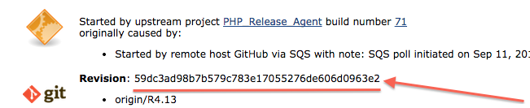

# PHP Agent Release Checklist

## Contents
* [Additional Resources](#additional-resources)
* [Prerequisites](#prerequisites)
* [Things to Check Before Release](#things-to-check-before-release)
* [Cutting a Release Branch](#cutting-a-release-branch)
* [Promoting a Release Build to Testing](#release-2-testing)
* [Promoting a Build from Testing to Production](#testing-2-production)
* [Rolling Back the Current Release](#rollback)
* [Git Branches](#git-branches)
* [Promoting a Release Build to Testing](#release-2-testing)
* [Promoting a Build from Testing to Production](#testing-2-production)

## Additional Resources
* [PHP Agent FAQ](https://docs.newrelic.com/docs/php/new-relic-for-php)
* [Deploy Study Guide for Agents](https://pages.datanerd.us/engineering-management/processes/software-development-process/deploy-agents-study-guide.html)
* [Availability Study Guide for Agents](https://pages.datanerd.us/engineering-management/processes/software-development-process/availability-study-guide.html)
* [Jacob Affinito's Write-up on S3 Commands](https://docs.google.com/a/newrelic.com/document/d/1a0PIBUNgnqrnPGRYNpgW616zap5MU-_e2KpXka20FW0/edit?usp=sharing)

Check our [CHANGELOG](CHANGELOG) and [release notes](https://docs.newrelic.com/docs/release-notes/agent-release-notes/php-release-notes).

## <a name="prerequisites"></a> Prerequisites
You will need to have the following:

* Access to the [PHP Jenkins instance](https://phpagent-build.pdx.vm.datanerd.us)


## Things to Check Before Release
* Ensure that all JIRA tickets have been closed and tested.
* Ensure that all new features, bug fixes are listed in the [source change log][CHANGELOG].
* Prep the [release notes](#release-note) and any relevant
  [documentation changes](#documentation-changes); have them ready for when we
  release.
* Ensure automated tests give you sufficient confidence and that you have
  run any tests that may not run as part of the automated tests (under "Things
  To Do Before You Make a Pull Request"). Here's a quick overview of those tests:


| Test Type | Description / What to Check | Report | KickOff |
|-----------|-----------------------------|--------|---------|
|[Cross Platform][xplatform-wiki] | Installation and sanity on various platforms. Make sure it's green, or has a good reason for not being green. | [xPlatform Jenkins Results][xplatform-jenkins-results] | Automatic from [php-deploy.sh][php-deploy-tests], push to testing repository |
|[Features][orion-wiki] | Feature regression across various PHPs and frameworks. Make sure it's green, or has a good reason for not being green. | [Orion Jenkins Results][orion-results]  | Automatic from [php-deploy.sh][php-deploy-tests], push to testing repository |
|[Stability][delphi-wiki] | Three-day burn-in test.  Check memory and CPU use of daemon and agent. Look for ramp-ups in resource use over time. | [Delphi/Panoptes PHP Stability][delphi-stability-tests] | Probably automatically kicked off by pushing to testing, but if results are bad, hit "[Build Now][start-panoptes-stability]" button in Jenkins |
|[Performance][delphi-wiki] | Throughput measured over time, over different agent configurations, multiple samples. Take this with a grain of salt until we have this running on a more stable platform.  Drill into the latest build to see how the latest agent performed over features enabled/disabled. | [Delphi/Panoptes PHP Performance][delphi-performance-tests] | Probably automatically kicked off by pushing to testing, but if results are bad, hit "[Build Now][start-panoptes-performance]" button in Jenkins. |
[xplatform-wiki]: https://newrelic.atlassian.net/wiki/pages/viewpage.action?pageId=41287713
[orion-wiki]: https://newrelic.atlassian.net/wiki/display/eng/QA+PHP+Orion+Autotest
[delphi-wiki]: https://newrelic.atlassian.net/wiki/display/eng/Automation+test+results+-+Delphi
[xplatform-jenkins-results]: https://phpagent-build.pdx.vm.datanerd.us/view/QA/job/QAPhpAutotest_xPlatform/
[php-deploy-tests]: https://phpagent-build.pdx.vm.datanerd.us/view/QA/job/QAPhpAutotest_xPlatform/
[orion-results]: https://phpagent-build.pdx.vm.datanerd.us/view/QA/job/QAPhpAutotest_OrionRegression/
[delphi-stability-tests]: http://pdx-delphi-1.pdx.vm.datanerd.us/stability_tests?filter=2
[delphi-performance-tests]: http://pdx-delphi-1.pdx.vm.datanerd.us/performance_tests?filter=2
[start-panoptes-stability]: https://phpagent-build.pdx.vm.datanerd.us/view/QA/job/QAPhpAutotest_StartPanoptesStability/
[start-panoptes-performance]: https://phpagent-build.pdx.vm.datanerd.us/view/QA/job/QAPhpAutotest_StartPanoptesPerformance/

* Other non-automated tests can be run, depending on what's changed in the release:
  - [High-load Performance](https://newrelic.atlassian.net/wiki/display/eng/PHP+Cross-Agent+Throughput+Tester):
  Write a PHP script that's relevant to changes in this release and point this
  script at it. When it's done, review output and compare with APM UI.
  - [CAT](https://newrelic.atlassian.net/wiki/display/eng/QA+PHP+Manual+Testing+--+CAT)
* Ensure that the agent version number is correct: 
[https://source.datanerd.us/php-agent/php_agent/blob/master/VERSION](https://source.datanerd.us/php-agent/php_agent/blob/master/VERSION)
* And the codename:  <br />
[https://source.datanerd.us/newrelic/php_agent/blob/master/axiom/nr_version.c](https://source.datanerd.us/newrelic/php_agent/blob/master/axiom/nr_version.c)
* Ensure that all new features, API changes, and configuration changes have
  appropriate public documentation branches.
* Ensure that all new or modified configuration options are documented within
  the ini template.
* Ensure that all bug patch commits on master have been applied to the release
  branch.
* Ensure that all URLs embedded in code (agent, daemon, installer) and
  documentation we ship are live and point to something reasonable.

## <a name="cutting-a-release-branch"></a>Cutting a Release Branch

#### 0. Ask the annoying questions

You've probably already answered these, but just to make sure...

* Does master reflect all the work that's going into this release? 
* Are there any outstanding PRs that haven't been merged to master that should be in this release? 
* Does the CHANGELOG.md file on master reflect all those things?

#### 1. Update hudson `php-release-*` job configurations
The three jobs which need to be changed are:
* `php-release-agent`
* `php-release-packages`
* `php-release-tarballs`

Change the "Branches to build" entry on each of these pages. The branch name
convention is to use "Rx.y" (e.g., "R4.13" for the 4.13 release):
* [https://phpagent-build.pdx.vm.datanerd.us/view/All/job/php-release-agent/configure](https://phpagent-build.pdx.vm.datanerd.us/view/All/job/php-release-agent/configure)
* [https://phpagent-build.pdx.vm.datanerd.us/view/All/job/php-release-packages/configure](https://phpagent-build.pdx.vm.datanerd.us/view/All/job/php-release-packages/configure)
* [https://phpagent-build.pdx.vm.datanerd.us/view/All/job/php-release-tarballs/configure](https://phpagent-build.pdx.vm.datanerd.us/view/All/job/php-release-tarballs/configure)

#### 2. Run `create-release-branch.sh`

First, pull the latest changes from the php_agent repository.

In the php deployment repository, find this script:
```
./hudson/create-release-branch.sh
```

Run this script from the php_agent directory, executing the following command:

```JENKINS_TOKEN=<your token> JENKINS_USER=<your username> hudson/create-release-branch.sh```

Jenkins generates a different API token for every user. Your API token can be found at 
https://phpagent-build.pdx.vm.datanerd.us/user/\_YOUR\_USERNAME\_/configure.

#### 3. Push the new release branch to `php-agent/php_agent`
(This step used to be part of the `create-release-branch.sh` script above.
However, with our move to GHE, some engineers have `php-agent/php_agent` as
`origin`, and others `upstream`. Therefore, this push step is now manual.)


E.g., if using `php-agent/php_agent` as origin, then for the 4.13 release you would use:

```bash
git push origin R4.13
```

If it is successful, you should subsequently see the `php-release-agent`,
`php-release-packages`, `php-release-tarballs` jobs building in Jenkins.

Wait for those jobs to complete before proceeding with the next (likely) step:
[Push to Testing](#release-2-testing).

## <a name="release-2-testing"></a>Promoting a Release Build to Testing

#### 1. Verify LSM and .NET Core are not deploying

The PHP, LSM, and .NET Core agents conceptually share a global "lock" on the download site and the 
pdx-util replica. There is currently no means that absolutely guarantees this exclusivity. 
The Native Agent team is currently the owner of the LSM agent; ask your team members whether
they are currently deploying LSM. To determine whether the .NET Core agent is deploying, contact 
their `@hero` on Slack.  

#### 2. Get version number

Consult the [Jenkins release job](https://phpagent-build.pdx.vm.datanerd.us/view/All/job/php-release-tarballs/) to find a version number that takes this format: `6.8.0.177`.

#### 3. (Optional) Rollback old release from testing

> _We occasionally push master builds **directly** into testing (e.g., to give automated tests
> a chance to run on an early build of a feature before we actually cut a release). If
> this was done, then there is a very good chance that the version number of what
> is currently in testing is bigger than (and therefore appears newer than) what
> we are about to push in from the release build._
> 
> _This situation will sometimes cause problems because the the older master
> build will appear to be "newer than" the release build that we actually want to
> test._

Check to see if ther are any testing releases to remove by checking the [testing download site][testing-download-site].

To remedy this situation, visit the [php-rollback-agent](https://phpagent-build.pdx.vm.datanerd.us/view/All/job/php-rollback-agent/) job and click "Build with Parameters" in the left-hand nav. On the following screen, choose "release-2-testing" and type the full version number of the agent. Hit "Build."


#### 4. Run the php-publish-agent Hudson job
Visit the [php-publish-agent](https://phpagent-build.pdx.vm.datanerd.us/job/php-publish-agent/) job and click "Build with Parameters" in the left-hand nav. On the following screen, type the full version number of the agent and choose "testing." Hit "Build."

Wait for the job to finish before starting the next step. If you'd like to see what it's doing, click the running job on the left-hand side and then view its console output.

> _This will download and combine the existing files from S3 with the new version of the agent, generate new package repository metadata, then upload it back to S3. The tarballs and archives won't work properly, however, so quickly move on to the next step._

#### 5. Index S3

Find the [Build S3 Index](https://phpagent-build.pdx.vm.datanerd.us/view/All/job/Build%20S3%20Index/) job on our Hudson box. Click "Build with Parameters", choose the "Staging" repository, and click the "Build" button. Watch the console output of the job you just started by clicking the progress bar to the left.

> _Unfortunately, S3 doesn't automatically create directory indices. It doesn't even really understand the concept of directories. We need to put index.html files in place so tarfile customers can find the files they need. The customers using package managers don't need directory indices, so this doesn't affect them._

Depending on whether you are deploying to staging or production, verify your result at the [staging download site](http://nr-downloads-private.s3-website-us-east-1.amazonaws.com/75ac22b116/) or [production download site][download-site].  On the production site, be sure to
check the `/php_agent/archive` directory contents too! Make sure the server monitor is **not** deleted.

#### 6. Tag the commit with the revision number

1. Get the revision value of the commit used for the release build from Jenkins:
  * Open [the Jenkins Release job for a specific slave](https://phpagent-build.pdx.vm.datanerd.us/view/All/job/php-release-agent/label=centos5-32-nrcamp/)
  * Click on the link for the correct build and look for the "**Revision**:" value (i.e., the git SHA); E.g.,

2. In the `php_agent` directory, run the following:

```bash
git tag -a v<version> -m "manual release-2-testing push" <git SHA>
git push --tags
```

E.g., if using `php-agent/php_agent` as origin, then for the 4.13 release you would use:

```bash
git tag -a v4.13.0.70 -m "manual release-2-testing push" 8e14a9617bbfd0729ab9a7b5c48215af4aaa4a21
git push --tags
```

#### 7. Tell everybody it's there
Let the team know that the new release is sitting in the testing repository. Email 
gts-php@newrelic.com to alert our Support Team of the upcoming release. Also, contact 
your Product Manager and ask them to review the release notes and make them even more 
marketing-savvy than they already are.

#### 8. Start some QA! Run the cross-platform installation and sanity checks on the new agent:

https://phpagent-build.pdx.vm.datanerd.us/view/QA/job/QAPhpAutotest_xPlatform/


## <a name="testing-2-production"></a>Promoting a Build from Testing to Production
#### 0. Is is OK to release?
Releasing in the morning gives us more work hours to monitor for problems and
quickly react. Releasing before the weekend makes life more difficult for our Support Team,
and much more difficult for you if there's something wrong with the release.

#### 1. Get a co-pilot
The CAB needs somebody to watch you type and follow our "runbook," which is
this checklist. See the [CAB process documentation][CAB-process].

#### 2. Get version number
You need to know the full version number of the build you want to deploy.
Typically this is a version you previously pushed to testing. Consult the
[testing download site][testing-download-site] for this typical case.

#### 3. Verify LSM is not deploying
The PHP and LSM agents conceptually share a global "lock" on the download site and the pdx-util replica. There is currently no means that absolutely guarantees this exclusivity. Reach out to that team (they may be you) and coordinate.

#### 4. Run "testing-2-production" action

In hudson, look at the [php-publish-agent](https://phpagent-build.pdx.vm.datanerd.us/view/All/job/php-publish-agent/) job.
Click "Build with Parameters", choose the `testing-2-production` option in the drop-down and type the version number. Click "Build," then watch the console output of the job you just started by clicking the progress bar to the left.

#### <a name="index-s3"></a>5. Index S3

Find the [Build S3 Index](https://phpagent-build.pdx.vm.datanerd.us/view/All/job/Build%20S3%20Index/) job on our Hudson box. Click "Build with Parameters", choose the "Production" repository, and click the "Build" button. Watch the console output of the job you just started by clicking the progress bar to the left.

> _Unfortunately, S3 doesn't automatically create directory indices. It doesn't even really understand the concept of directories. We need to put index.html files in place so tarfile customers can find the files they need. The customers using package managers don't need directory indices, so this doesn't affect them._

Verify the result at the [production download site][download-site]. Be sure to
check the `/php_agent/archive` directory contents too! Make sure the server monitor
is **not** deleted.

#### 6. Test the public repositories  
Bring up an Ubuntu/Debian machine and a Red Hat/CentOS machine. Download the
agent and make sure the installation step works.

#### 7. Make New & Noteworthy
Remind your Product Manager to add
New & Noteworthy entries (multiple) via [Fog Lights](https://fog-lights.datanerd.us/) 
for the key feature(s) or improvement(s) in the release. 
* Include a descriptive title so that it is identifiable across all possible
N&Ns (e,g., "High-Security Mode for PHP" rather than simply "High-Security
Mode") 
* Include an image - something memorable, iconic, or screen-captured is
great 
* Don't include details about specific engineers

#### 8. Create Public Release Notes
View the release notes in our GitHub changelog. Check with your Product Manager to see
if they have any changes to the release notes sent to them when this release was 
pushed into the testing repository.

To publish to the external documentation site, make sure you're authenticated
via [Okta][okta] then use the Okta link to log into the Drupal externally-facing
documentation site [at docs.newrelic.com](http://docs.newrelic.com) and visit
the release notes page. Click the most recent entry's title, click the "Clone
content" link, and have at it. You'll probably want to remove anything under the
"Internal Changes" section.

After you're happy with it, go down to the very bottom of the editing page,
click the "Revision information" tab on the left, and set the "Moderation
state" to "Ready for Publication." Then save it and revisit the release notes
page to make sure it's all correct.

#### 9. Update Core Configuration Version Number

Update the `php_agent_version` configuration variable in the [Core App system configuration](https://rpm-admin.newrelic.com/admin/system_configurations?utf8=%E2%9C%93&q%5Bkey_contains%5D=php&commit=Filter&order=key_asc)

Also note the existence of the related `min_php_agent_version` ... which is not
typically updated.

#### 10. Email agent-releases@newrelic.com
We need to contact our partners (such as PHPFog, CloudControl, Aquia) to get
the agent version upgraded for their offerings. Send an email to
[agent-releases@newrelic.com](mailto:agent-releases@newrelic.com) notifying
them about the release. This will go to agent-team, partnership-team, and other
interested parties. A brief statement (effectively the New and Noteworthy)
should be included in the email. Lacking New and Noteworthy, just put the
public release notes in there.

If possible, set reply-to: `agent-team@newrelic.com`. (This is pretty hard to
do in Gmail, and I skipped it for the 5.0.0.115 release.)

#### 11. Update feature flags
If any new functionality was gated by feature flags in APM, make sure that they
are set to the right value for release.

#### 12. Push Documentation Changes
Push any related documentation changes to production. This includes any drafts
waiting in the wings for agent release, setting their status to "Ready for
Publication."

One particular documentation update that may be easy to overlook is changes to
the Heroku-specific template INI file that we have posted to the Docs site.

#### 13. Notify Heroku
The Heroku buildpack will need to be updated in order to have it consume the
new version.

Email David Zuelke ([dz@heroku.com](mailto:dz@heroku.com)), letting Heroku know of
new agent availability so that the Heroku PHP buildpack will be updated.

#### 14. Track Patch Releases
If this was a patch release, add it to the [Rollbacks and Patch
Releases][rollbacks-patch-releases] on the wiki for tracking.

#### 15. Notify Customers and the Product Manager
Contact all the customers whose stories and bugs are labeled with "from
customer" in the current release. Once contacted, add the label "customer
notified". The [PHP Support Team](https://newrelic.atlassian.net/wiki/display/SUP/Cephalopod+Specialty+Group)
often helps us with this task, or performs it entirely.

Tell the team's Product Manager about the release so they can manage feature
requests.

#### 16. Mark release in JIRA
Visit
[https://newrelic.atlassian.net/projects/PHP](https://newrelic.atlassian.net/projects/PHP), click the "Releases" icon on the left,
locate the release, click the little ellipsis which is invisible until you roll
over it, and use the drop-down menu to mark the release as released.

Currently (2/2016) only Rich and Chris Pine have access to change this.

## <a name="rollback"></a><a name="rolling-back-the-current-release"></a> Rolling Back the Current Release

#### 1. Get version numbers
For example, "4.20.0.92" could be the offending release, so you want to
downgrade things to "4.19.0.90" while you figure out a patch release.

#### 2. Contact Support
Tell support what's going on. They'll stay on top of customers for you, provide
you with status updates, and even do testing for you.

They may like to know that their customers who are using package management can
temporarily downgrade themselves to the most recent release with these
commands, using the 4.19.0.90 version of the agent as the version the customer
wants to move to:

**CentOS/Red Hat**:
```bash
yum downgrade newrelic-php5-4.19.0.90 newrelic-php5-common-4.19.0.90 newrelic-daemon-4.19.0.90
```

**Ubuntu/Debian**:
```bash
apt-get install newrelic-php5=4.19.0.90 newrelic-php5-common=4.19.0.90 newrelic-daemon=4.19.0.90
```

#### 3. Verify LSM is not deploying

The PHP and LSM agents conceptually share a global "lock" on the download site
and the pdx-util replica. There is currently no means that ensures this
exclusivity. Reach out to that team and coordinate.

#### 4. Run the rollback job

Visit the [php-rollback-agent](https://phpagent-build.pdx.vm.datanerd.us/view/All/job/php-rollback-agent/) job and click "Build with Parameters" in the left-hand nav. On the following screen, type the full version number of the agent and choose "production." Hit "Build."

#### 5. Index S3

See the instructions on how to do this in the ["Promoting a Build from Testing to Production"](#index-s3) section above.

#### 6. Verify results

Ensure that the LSM hasn't been deleted.

Verify the result at the [production download site][download-site]. Uninstall
and re-install the agent from packages CentOS and Ubuntu VMs.

#### 7. Copy the previous release's build products into the release directory

**THE `AWS S3` COMMANDS BELOW HAVE NOT BEEN TESTED.**

_They were pretty carefully put together by Rich, though._

> Eventually, the rollback script should do this for us, but for the time being,
> you'll be left with an empty [http://download.newrelic.com/php_agent/release/](http://download.newrelic.com/php_agent/release/)
> directory.

You'll need to use the `aws s3` tool to very carefully copy the build products
from the previous release into that directory:

```bash
aws s3 --profile=production cp --recursive --exclude "*" --include "newrelic-*.tar.gz" s3://nr-downloads-main/php_agent/archive/<FULL_AGENT_VERSION_NUMBER>/ s3://nr-downloads-main/php_agent/release/
```

This has to be done on both servers noted above, as they don't share filesystems.

#### 8. Add a placeholder page to the archive directory.

> You may want to add an index.html to the archive directory for the buggy
> version to prevent users from accessing the download links. An example can be
> found here:
> [https://source.datanerd.us/gist/aharvey/d8d749c6adac27dfd5a2](https://source.datanerd.us/gist/aharvey/d8d749c6adac27dfd5a2).
Again, you will have to run commands directly on the download servers listed
above to move the file into place; for example:

```bash
aws s3 --profile=production cp index.html s3://nr-downloads-main/php_agent/archive/<FULL_AGENT_VERSION_NUMBER>/
```

Want to completely remove the release from the archive directory instead? Be my guest:
```bash
aws s3 --profile=production rm --recursive s3://nr-downloads-main/php_agent/archive/<FULL_AGENT_VERSION_NUMBER>
```

#### 9. Track Rollback
Add the release (with a note or two) to the [Rollbacks and Patch
Releases][rollbacks-patch-releases] on the wiki for tracking.


[CHANGELOG]: https://source.datanerd.us/newrelic/php_agent/blob/master/CHANGELOG.md
[download-site]: https://download.newrelic.com
[testing-download-site]: http://nr-downloads-private.s3-website-us-east-1.amazonaws.com/75ac22b116/
[cab-process]: https://pages.datanerd.us/engineering-management/processes/software-development-process/cab.html
[okta]: https://newrelic.okta.com
[rollbacks-patch-releases]: https://newrelic.atlassian.net/wiki/display/eng/PHP+Agent+Rollbacks+and+Patch+Releases
